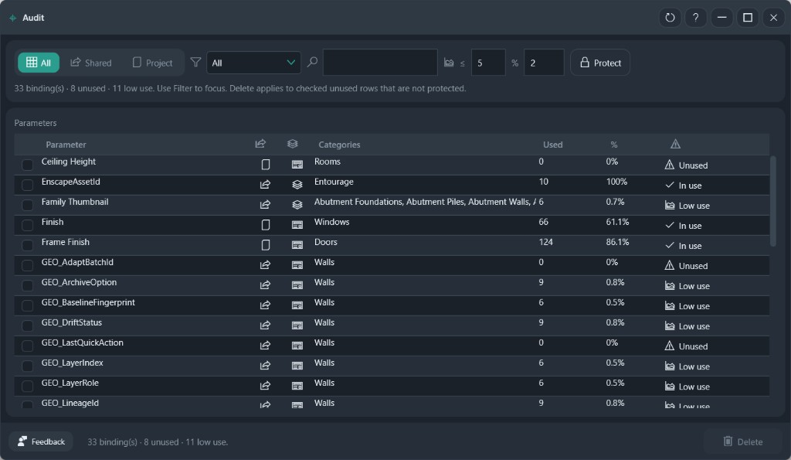

# Audit Parameters

See which shared and project parameters are unused, barely used, or in use. Delete only the unused rows you check, and only when they are not protected.

**Ribbon:** Audit++ → Audit Parameters

## Filters

| Control | What it does |
|---------|----------------|
| All / Shared / Project | Which bindings are listed |
| Issue filter | All, Unused, or Low use |
| Search | Parameter name |
| Two percent boxes | Low use when the used count is at or below the first number, or the percent is at or below the second. The screenshot uses ≤ 5 and ≤ 2% |
| Protect | Point at an office shared-parameter file. Those parameters stay unchecked. Pro |

The line under the filters is the legend for the current scan. In the screenshot: 33 bindings, 8 unused, 11 low use. Delete applies to checked unused rows that are not protected.

## Grid

| Column | Meaning |
|--------|---------|
| Parameter | Binding name |
| Icons | Shared or project, and instance or type |
| Categories | Where it is bound |
| Used | Elements with a non-empty value |
| % | Used count against the eligible elements |
| Status | Unused, Low use, or In use |

## Workflow

1. **Refresh** if the counts are still empty.
2. Filter to **Unused** when you are cleaning.
3. Check the rows to remove. Leave protected and in-use rows alone.
4. **Delete**.

Schedules and view filters are not part of the used count. A parameter that only appears there can still show as unused.

Family-parameter cleanup is not this window. Mapping-package checks stay in Information++ Validate Package and Rules.

## Recommended workflows

**Remove bindings nobody filled**

1. Click **Protect** first if you have an office shared-parameter file. Protected names stay unchecked. Protect is Pro.
2. Set the issue filter to **Unused**.
3. Read **Used** and **%**. Unused means no non-empty value on the bound categories.
4. Check the rows you are willing to remove. Leave anything you added for a future package.
5. **Delete**. The footer deletes checked unused rows that are not protected. In-use rows are not the delete target.

**Find parameters that are almost empty**

1. Set the two boxes. The screenshot uses a used-count of 5 and a percent of 2. A row at or below either value is **Low use**.
2. Filter to **Low use** and decide one by one. Low use is a review list, not an automatic delete.

Switch **Shared** or **Project** when the list mixes both and you only want one kind. The category column shows where the parameter is bound. A parameter that appears only in a schedule can still show as unused, because schedules are not counted.
