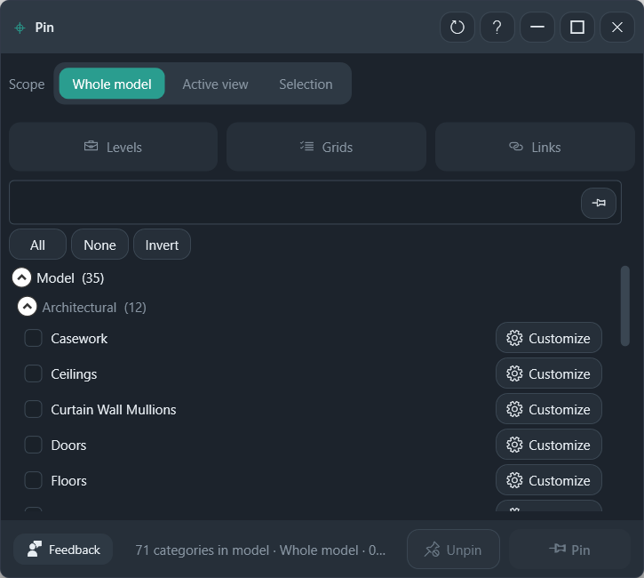

# Pin

Pin or unpin many elements with Revit's own pin.

**Ribbon:** Audit++ → Pin

## Layout

| Control | What it does |
|---------|----------------|
| Scope | Whole model, active view, or current selection |
| Levels / Grids / Links | Jump to those categories |
| Search | Filter the category tree |
| All / None / Invert | Check the visible categories |
| Customize | Open that category's elements before you pin |
| Unpin / Pin | Apply the native Revit pin to the checked categories |

The footer shows how many categories are in the model and which scope is active.

## Workflow

1. Set the scope. **Whole model** is the widest.
2. Check categories, or use **Levels**, **Grids**, or **Links** when that is all you need.
3. **Customize** a category when you want to drop individual elements from the batch.
4. **Pin** or **Unpin**.

Pin and Unpin do not create a second LOD++ flag. They set the pin Revit already uses.

## Recommended workflows

**Lock grids, levels, and links**

1. Set scope to **Whole model**.
2. Click **Levels**, **Grids**, and **Links** instead of browsing the full tree.
3. **Pin**.

**Unpin only what you need to move**

1. Select those elements in Revit.
2. Set scope to **Selection**.
3. Check their categories, or **Customize** a category and drop the elements that must stay pinned.
4. **Unpin**.

**Customize** is the review step. Use it when a category mixes elements you pin with elements you still edit. Whole model plus every category will pin content you did not mean to lock.
