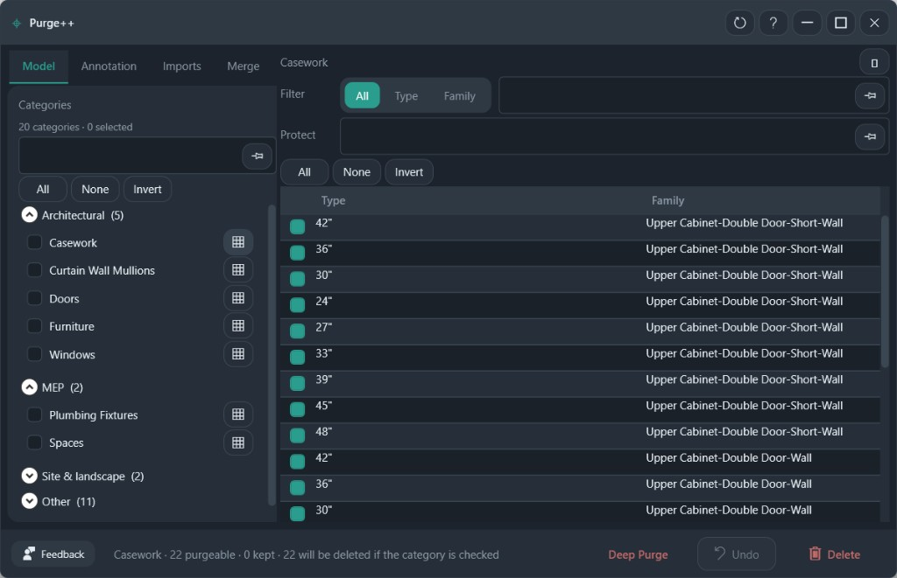

# Purge++

Preview unused items by category, then delete the ones you leave checked.

**Ribbon:** Audit++ → Purge++

## Layout

| Area | What it does |
|------|----------------|
| Model / Annotation / Imports / Merge | Which library you are cleaning |
| Categories | Groups such as Architectural, MEP, Site & landscape, Other |
| Customize | The grid icon loads that category's unused items on the right |
| Filter | All, Type, or Family, plus a name search |
| Protect | Names that must not be deleted |
| Grid | Type and family. Uncheck a row to keep it |
| Footer | **Deep Purge**, **Undo**, **Delete** |

The footer states the consequence before you delete. In the screenshot: Casework has 22 purgeable items, 0 kept, and 22 will be deleted if the category is checked.

## Workflow

1. Stay on **Model** unless you are cleaning annotation, imports, or running a merge.
2. Check a category on the left, or open **Customize** to review its rows first.
3. Uncheck types you want to keep. Use **Protect** for names that should survive every purge.
4. Read the footer count.
5. **Delete**.

Delete of the previewed unused items is available without Pro. **Deep Purge** opens family-level cleanup and is Pro.

## Recommended workflows

**Clean one category**

1. Stay on **Model**.
2. Do not check every category. Click **Customize** on one category, such as Casework.
3. Uncheck types you still place. Use the family filter when several types share a family you want to keep.
4. Read the footer. It states how many will be deleted if that category is checked.
5. Check the category, then **Delete**. **Undo** is available after that write.

**Keep office names out of every purge**

1. Put the protected names in **Protect** before you check categories.
2. Then customize and delete. Protected names stay even if the category is checked.

Run Annotation, Imports, and Merge as their own passes. Mixing them with Model in one delete makes the undo harder to read. **Deep Purge** is a second window for families, after the project list is already clean.
