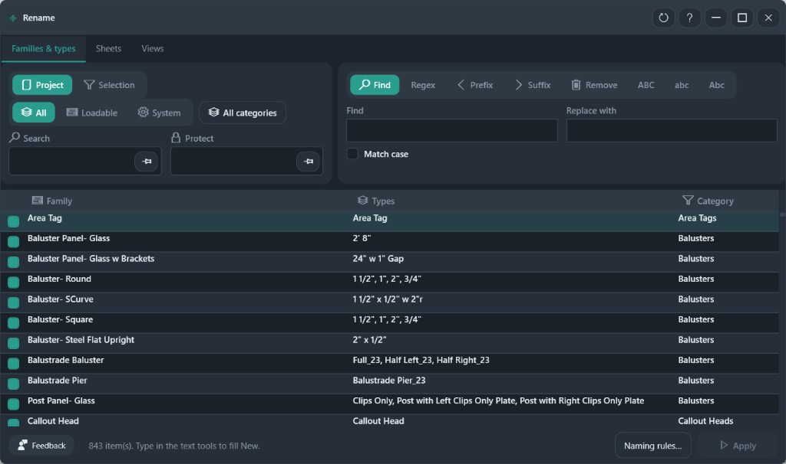

# Rename

Rename families, types, sheets, and views. The text tools fill the new name. Apply writes it.

**Ribbon:** Audit++ → Rename

## Tabs

| Tab | What you rename |
|-----|-----------------|
| Families & types | Family and type names |
| Sheets | Sheet names and numbers |
| Views | View names |

## Families and types

| Control | What it does |
|---------|----------------|
| Project / Selection | Where the inventory comes from |
| All / Loadable / System | Which families are listed |
| All categories | Limit the list to one category |
| Search | Filter the grid |
| Protect | Names that Apply will skip. Pro |
| Find, Regex, Prefix, Suffix, Remove | Fill the new name from the current name |
| ABC / abc / Abc | Change case |
| Match case | Find respects capitalization |
| Naming rules… | Pattern rename from the Excel NamingConvention sheet |
| Apply | Write the new names |

The grid shows Family, Types, and Category. Check a row before a text tool or Apply. The footer in the screenshot reports 843 items and tells you to type in the text tools to fill **New**.

## Workflow

1. Open the tab you need.
2. Load the list (Project or Selection, then the family kind).
3. Check the rows to change.
4. Type a find/replace, or use Prefix, Suffix, Remove, or a case button.
5. Read the new names in the grid.
6. **Apply**. One undo step.

**Naming rules…** is the path for a repeating office pattern. The Find box is the path for a one-off change.

## Recommended workflows

**Add a prefix to one category**

1. Open **Families & types**.
2. Set **Loadable** if you are not renaming system families.
3. Open **All categories** and pick one category.
4. **All** to check those rows.
5. Click **Prefix**, type the prefix, and read the new names in the grid.
6. **Apply**.

**Change a repeated word**

1. Check the rows.
2. Type the old word in **Find** and the new word in **Replace with**.
3. Leave **Match case** off unless capitalization must match.
4. Use **Regex** only when Find is a pattern, not a plain word.
5. **Suffix**, **Remove**, and the case buttons (**ABC**, **abc**, **Abc**) fill **New** the same way. Apply writes **New**.

**Sheets and views**

Switch to **Sheets** or **Views** and use the same find, prefix, and suffix tools. **Naming rules…** loads the Excel NamingConvention sheet when the office pattern is too regular for a one-off replace.

**Protect** (Pro) skips names that must stay. Turn it on before Apply, not after.
