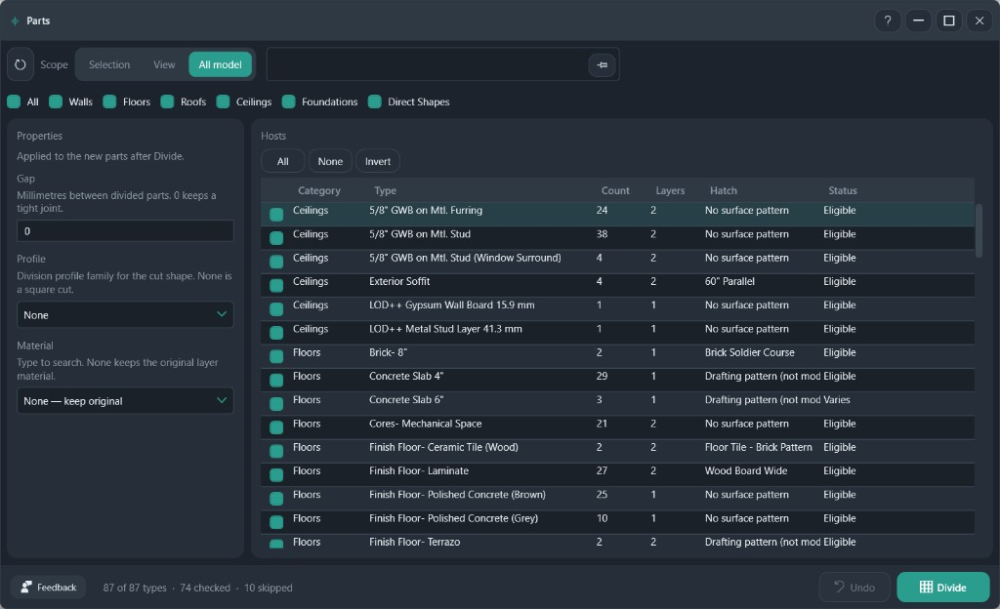

# Parts

Create parts on hosts, then divide them. The gap, profile, and material apply to the new parts.

**Ribbon:** Geometry++ → Parts

## Layout

| Area | What it does |
|------|----------------|
| Scope | Selection, view, or all model |
| Host filters | All, Walls, Floors, Roofs, Ceilings, Foundations, Direct Shapes |
| Gap | Millimetres between divided parts. `0` keeps a tight joint |
| Profile | Division profile family for the cut. **None** is a square cut |
| Material | Material on the new parts. **None — keep original** leaves the layer material |
| Hosts | Category, type, instance count, layer count, hatch, and status |
| Footer | **Undo**, then **Divide** |

## Workflow

1. Set the scope and the host filters.
2. Check the types to divide. Status **Eligible** can be divided. A row can also say the hatch is not eligible, or that the type varies.
3. Set gap, profile, and material. These apply to the new parts after Divide.
4. **Divide**.

Hosts that are already split by Geometry++ stay unchecked unless you check them yourself. Divide is Pro.

## Recommended workflows

**Divide floor finishes, leave the structure alone**

1. Set scope to **View** or **Selection**.
2. Turn on **Floors** and turn off Walls, Roofs, and Ceilings.
3. Check types whose Hatch column shows a surface pattern and whose Status is **Eligible**.
4. Leave **Gap** at `0` for a tight joint. Raise it only when the cut must show a gap, in millimetres.
5. Leave **Profile** at **None** for a square cut. Pick a profile family when the cut shape is a shaped division.
6. Leave **Material** at **None — keep original** unless the new parts must swap material.
7. **Divide**.

Skip rows that say the hatch is not eligible, or that the type varies, until you know why that type was excluded. Do not check hosts that Geometry++ already split unless you mean to divide those parts again.
