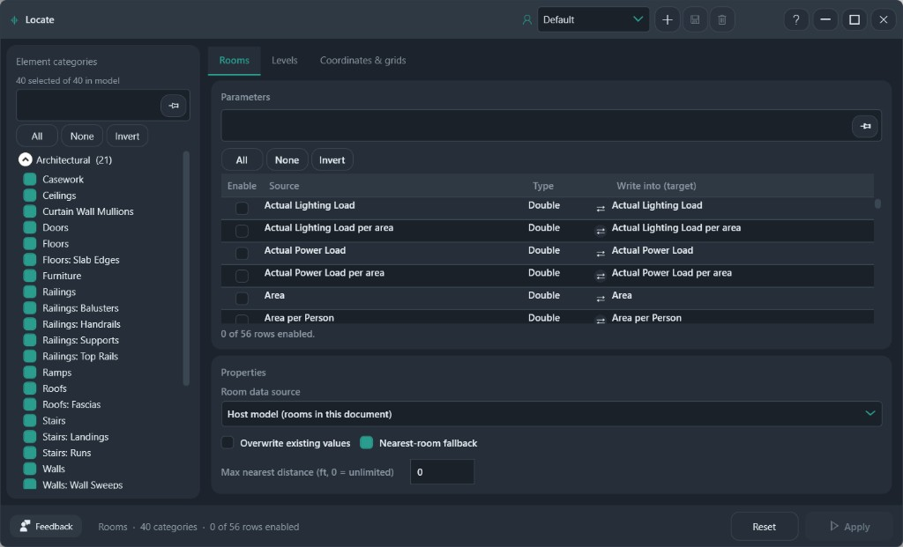
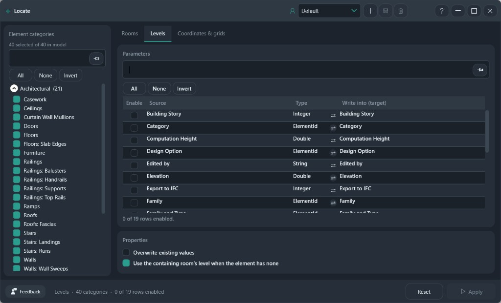
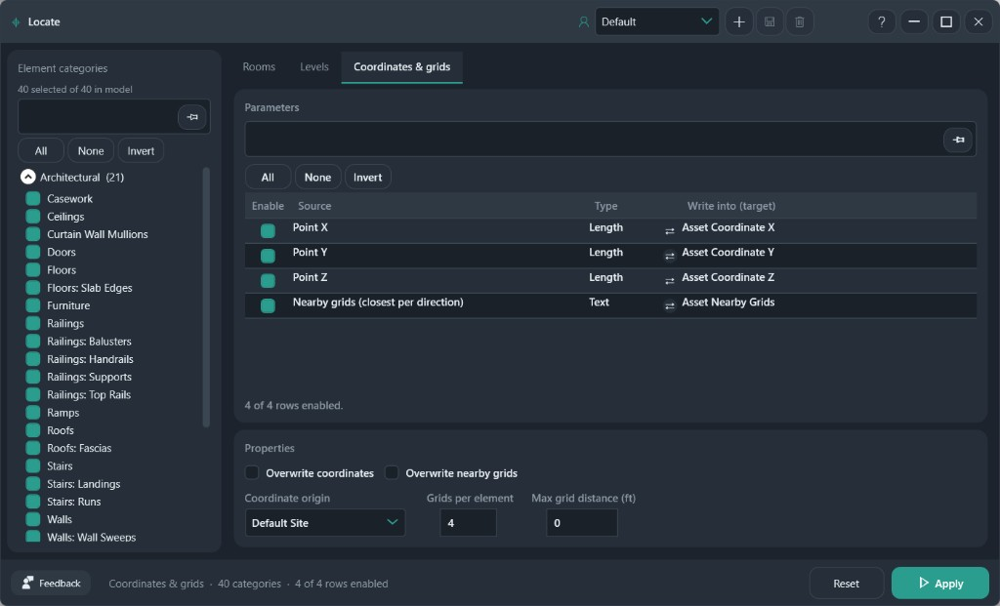

# Locate

Write room, level, coordinate, and nearby-grid values onto element parameters.

**Ribbon:** Information++ → Locate

## Layout

| Area | What it does |
|------|----------------|
| Header profile | Save, add, or delete a named setup. **Default** is the profile that cannot be deleted |
| Element categories | Categories in the model. Check the ones Locate should visit |
| Tabs | **Rooms**, **Levels**, and **Coordinates & grids** |
| Parameters | Enable a source row and choose the parameter it writes into |
| Properties | Options for the active tab |
| Footer | **Reset** restores the window. **Apply** writes the active tab |

The footer count shows the active tab, how many categories are checked, and how many parameter rows are enabled.

## Rooms

1. Check categories on the left. **All**, **None**, and **Invert** act on the list.
2. On **Rooms**, enable the room parameters you want (Area, Name, Number, and so on).
3. **Write into (target)** is the parameter on the element. The swap icon remaps the source onto a different target.
4. Under **Properties**:
   - **Room data source** — host rooms in this document, or rooms from a link when that option is listed.
   - **Overwrite existing values** — replace a value that is already filled.
   - **Nearest-room fallback** — if the element is not inside a room, use the nearest one.
   - **Max nearest distance** — `0` means no limit.

**Apply** writes only the enabled rows.

## Levels

Enable level fields such as Name, Elevation, or Building Story, then map each one to a target parameter.

- **Overwrite existing values** replaces filled targets.
- **Use the containing room's level when the element has none** fills a missing level from the room that contains the element.

## Coordinates and grids

This tab writes the element point and the nearest grids:

| Source | Typical target |
|--------|----------------|
| Point X, Y, Z | Asset Coordinate X, Y, Z (length) |
| Nearby grids | Asset Nearby Grids (text) |

Properties:

- **Overwrite coordinates** and **Overwrite nearby grids** control whether filled targets are replaced.
- **Coordinate origin** chooses the point origin, such as Default Site.
- **Grids per element** is how many nearby grids to record.
- **Max grid distance** — `0` means no limit. The unit follows the project (feet in the screenshot).

## After Apply

One **Apply** is one undo step for that tab. **Reset** puts the form back. It does not undo a write that already landed in the model. Use Revit Undo for that.

## Recommended workflows

**Room name and number on doors**

1. Check **Doors** only.
2. On **Rooms**, enable Name and Number. Leave the other room parameters off.
3. Turn on **Nearest-room fallback** if some doors sit outside a room.
4. Set **Max nearest distance** to a real limit, in project units, so a door does not pick up a room across the building.
5. Leave **Overwrite** off on the first run. **Apply**, spot-check, then turn Overwrite on only where the old value is wrong.

**Coordinates on furniture, grids on the same pass**

1. Check the furniture categories.
2. Open **Coordinates & grids**.
3. Enable Point X, Y, and Z, and Nearby grids.
4. Set **Coordinate origin** to the shared site you dimension from.
5. Set **Grids per element** to 2 or 4. Set **Max grid distance** so a grid on the other wing is ignored.
6. **Apply** this tab only. Rooms and Levels stay untouched until you open them and apply those tabs.

**Level name where the element has no level**

1. On **Levels**, enable Name and map it to your target.
2. Turn on **Use the containing room's level when the element has none**.
3. Leave overwrite off unless you intend to replace levels that are already filled.

Do not enable every source row. Locate writes each enabled row. A first run with two or three targets is easier to undo and check.
