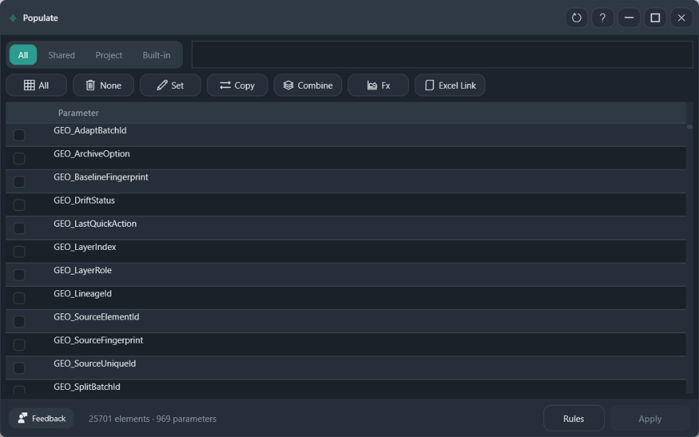

# Populate

Queue parameter writes, review every queued change, then apply them in one undo step.

**Ribbon:** Information++ → Populate

## What is included

Writes target model elements. Annotations, views, and materials stay excluded until those groups are turned on. Sketches, links, dimensions, and project settings are never included.

## Controls

| Control | Purpose |
|---------|---------|
| All / Shared / Project / Built-in | Filter the parameter list |
| Search | Find a parameter by name |
| Set | Queue one constant for the checked parameters |
| Copy | Queue a copy from another parameter, the family name, or the type name |
| Combine | Queue a joined string: prefix, parts, separator, and suffix |
| Fx | Queue a formula |
| Excel Link | Export a workbook, or import edited values back into the queue |
| Rules | Open the mapping-package rules |
| Apply | Open the review, then write. Requires Pro |

The profile bar stores the category groups and the queued actions so the same setup can run on another project.

## Procedure

1. Check one group of parameters that share the same action.
2. Choose **Set**, **Copy**, **Combine**, or **Fx**. The checks clear so the next group can use a different action. Parameters already queued stay highlighted.
3. Repeat for the next group.
4. **Apply**. The review lists every queued change. Remove or edit a row before you confirm.
5. Confirm. Type parameters are written once per type. The write is one undo step.

## Excel Link

Export creates a workbook named from the model. Each sheet includes Category, Family, Type, and Level, with filters and a Legend sheet. Columns you may edit are marked. Import reads those cells back into the queue. Nothing is written to the model until **Apply**.

## Recommended use

- Queue a small group, open the review, and confirm the targets before adding further actions.
- Leave **Only fill empty** on when existing values must be preserved.
- Save a profile after the queue is correct, then load it on the next project instead of rebuilding the actions.
