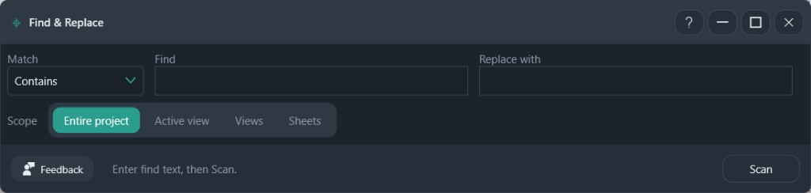
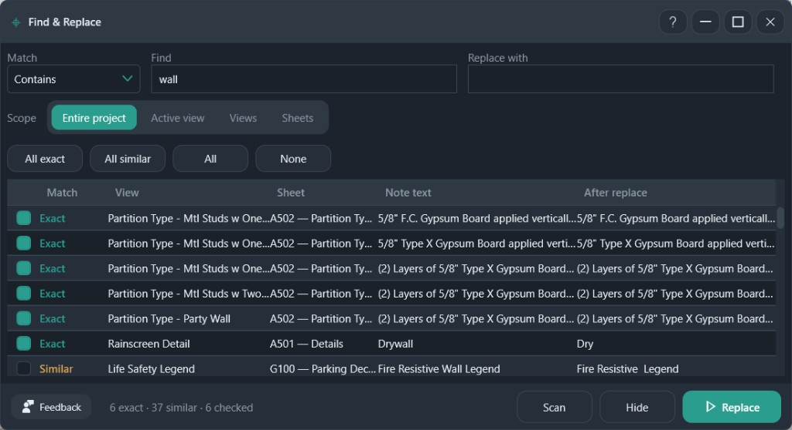

# Find & Replace

Find text in text notes, preview the replacement, and replace only the rows you check.

**Ribbon:** System++ → Find & Replace

## Before the scan

| Control | What it does |
|---------|----------------|
| Match | How the find text is compared. **Contains** is the default |
| Find | Text to look for |
| Replace with | Text to write. Leave it empty to clear the match |
| Scope | Entire project, active view, chosen views, or chosen sheets |
| Scan | Build the preview. Nothing is written yet |

## After the scan

| Column | Meaning |
|--------|---------|
| Match | **Exact** or **Similar** (case or spacing differs) |
| View / Sheet | Where the note sits |
| Note text | Current text |
| After replace | What the note will become |

**All exact**, **All similar**, **All**, and **None** check rows. Unchecked rows stay unchanged.

**Hide** collapses the result grid. **Replace** writes the checked rows in one undo step.

In the screenshot, Find is `wall`, six exact notes are checked, and one similar note ("Fire Resistive Wall Legend") is left unchecked. The footer reads `6 exact · 37 similar · 6 checked`.

## Recommended workflows

**Replace one word on the notes you trust**

1. Set **Match** to **Contains**.
2. Type the word in **Find** and the replacement in **Replace with**.
3. Start with **Active view**. Use **Entire project** after that view looks right. **Views** and **Sheets** limit the scan to the ones you pick.
4. **Scan**.
5. Click **All exact**. Leave **Similar** unchecked unless you have read those rows. Similar means the text differs by case or spacing.
6. Read **After replace** on a few rows.
7. **Replace**. Unchecked notes stay as they are.

**Clear a phrase**

Leave **Replace with** empty. Scan, check the rows, and Replace. The match is removed and the rest of the note remains.

**Hide** only collapses the grid. It does not cancel the scan. **Scan** again after you change Find, Replace with, or the scope.
