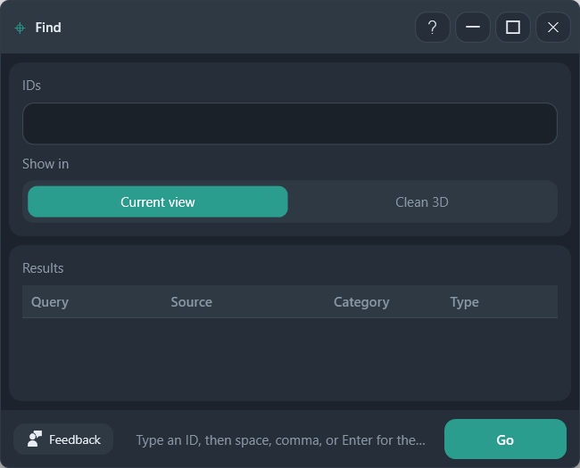

# Find

Resolve ElementId or UniqueId values in the host model and in loaded links, then show the elements.

**Ribbon:** System++ → Find

## Layout

| Area | What it does |
|------|----------------|
| IDs | One ID, or a list separated by space, comma, or Enter |
| Show in | **Current view** zooms in the view you have open. **Clean 3D** frames the element in a dedicated 3D view |
| Results | Query, source (host or link), category, and type |
| Go | Resolve the IDs |

The window stays open while you work in Revit.

## Workflow

1. Paste an ID, or a clash list, into **IDs**.
2. Choose **Current view** or **Clean 3D**.
3. **Go**.
4. Read **Results**. A link element shows the link as its source.

Clean 3D changes a view. That change is one undo step.

## Recommended workflows

**One warning**

1. Copy the Id from [Warnings](warnings.md).
2. Paste it into **IDs**.
3. Leave **Show in** on **Current view** if you are already on the right plan.
4. **Go**. The result row shows the source, category, and type.

**A clash list**

1. Paste the exported ids. Separate them with a space, a comma, or a new line.
2. Choose **Clean 3D** when the elements are not on the view you have open.
3. **Go** once for the whole list. Results that name a link are in that link, not in the host.

Leave the window open. You can paste the next id without starting the command again.
