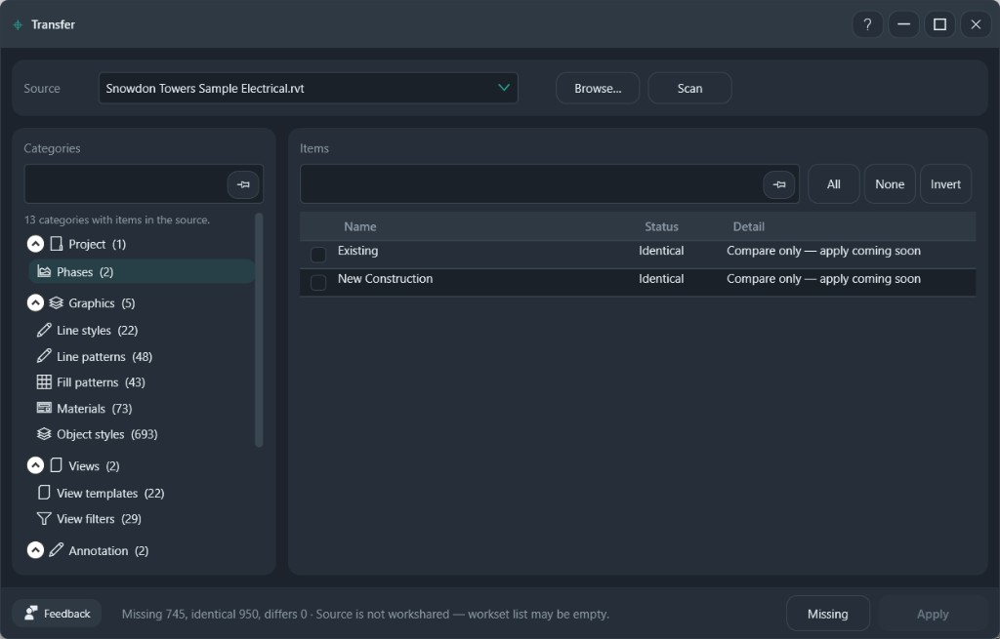

# Transfer

Compare another project with the active model and copy the standards that are missing.

**Ribbon:** System++ → Transfer

The active project is the target. Choosing a source scans it automatically. **Scan** runs the comparison again.

## Controls

| Control | Purpose |
|---------|---------|
| Source | An open project, or **Browse…** |
| Categories | Project, graphics, views, annotation, and related groups |
| Items | Name, status, and detail for the selected category |
| All / None / Invert | Check the items in view |
| Missing | Hide items the target already matches |
| Apply | Copy the checked items that can be created. Requires Pro |

The footer reports missing, identical, and differing counts.

## Procedure

1. Open the project that should receive the standards.
2. Select the source. The scan starts on its own.
3. Click **Missing**.
4. Open one category and check the names to copy.
5. **Apply**, then read the footer. Scan again if you need to confirm what remains.

## What is copied

| Item | Result |
|------|--------|
| Missing standards the API can create | Created in the target |
| Line styles and object styles, when checked | Created, and their graphics are updated |
| Worksets | Missing names are created. Elements are not assigned to them |
| Identical items | Left unchanged |
| Phases, design options, and in-place families | May stay compare-only when the Revit API does not allow the copy |

A row marked compare-only is visible so you can see the difference. **Apply** does not create it. A source that is not workshared has no worksets to create. The footer says so.

Check one category at a time. **All** applies to the list in front of you, not to every category in the tree.
