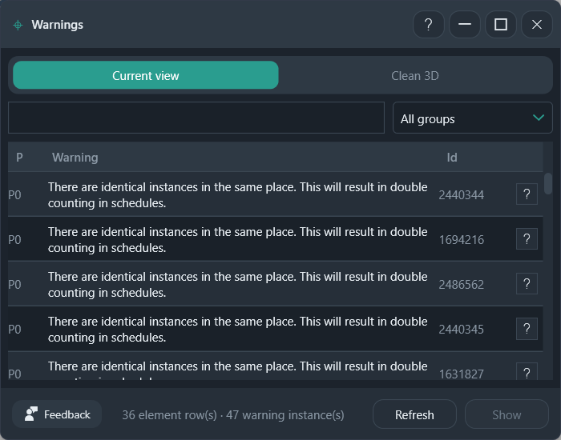

# Warnings

Browse the persistent warnings from Review Warnings, then zoom to an element.

**Ribbon:** System++ → Warnings

## Layout

| Control | What it does |
|---------|----------------|
| Current view / Clean 3D | Where **Show** sends you |
| Search | Filter the warning text |
| All groups | Show every warning group, or one group |
| P | Priority, such as P0 |
| Warning | The Revit warning text |
| Id | ElementId. The help icon on the row opens the short fix note |
| Refresh | Read the warnings again |
| Show | Zoom to the selected element |

The footer counts element rows and warning instances. In the screenshot: 36 element rows and 47 warning instances.

## Workflow

1. Open **Warnings**. The list loads from the active project.
2. Search or pick a group if the list is long.
3. Select a row.
4. Choose **Current view** or **Clean 3D**.
5. **Show**, or double-click the row.

Warnings does not delete or repair the element. Copy the Id into [Find](find.md) when you need the same element from a link.

## Recommended workflows

**Walk one warning type**

1. Open the group list and pick one warning, or type part of the text in search. The screenshot is the identical-instances warning.
2. Set **Show in** to **Current view** when you are on the plan where those elements should be.
3. Select the row and click **Show**.
4. Fix the element in Revit, then **Refresh**. The row drops out when Revit no longer reports it.

**When the element is not on this view**

Switch **Show in** to **Clean 3D**, then **Show**. The 3D view frames that element. Copy **Id** into Find if you also need to know whether it lives in a link.

**P** is the priority label, such as P0. It orders the list. It does not auto-fix the warning. The help icon on a row is the short note for that warning.
